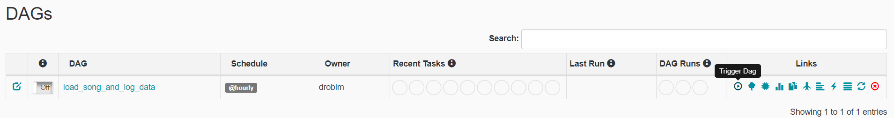
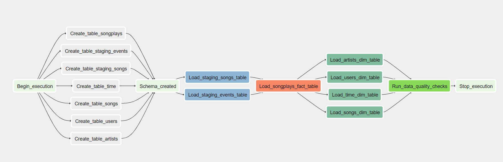

# Data Engineering NanoDegree

## Author
Deivid Robim [Linkedin](https://www.linkedin.com/in/deivid-robim-200b3330/)

### Project 5: Data Pipelines with Apache Airflow

A music streaming company, Sparkify, has decided that it is time to introduce more automation and monitoring to their data warehouse ETL pipelines and come to the conclusion that the best tool to achieve this is Apache Airflow.

As their data engineer, you are tasked with creat high grade data pipelines that are dynamic and built from reusable tasks, can be monitored, and allow easy backfills.

They have also noted that the data quality plays a big part when analyses are executed on top the data warehouse and want to run tests against their datasets after the ETL steps have been executed to catch any discrepancies in the datasets.

### Project Structure
```
Data-Pipelines-with-Airflow
│   README.md                    # Project description
│   requirements.txt             # Python dependencies
│
└───airflow                      # Airflow home
|   |
│   └───dags                             # Airflow DAGs location
│   |   │ load_song_and_log_data_dag.py  # DAG definition
|   |   |
|   └───plugins
│       │
|       └───helpers
|       |   | sql_queries.py     # All sql queries required
|       |
|       └───operators
|       |   | data_quality.py    # DataQualityOperator
|       |   | load_dimension.py  # LoadDimensionOperator
|       |   | load_fact.py       # LoadFactOperator
|       |   | s3_to_redshift.py  # S3ToRedshiftOperator
|___images
|   | dag_graph_view.png # DAG Graph View
|   | trigger_dag.png # DAG Tree View
|___src
|   | create_resources.py # Script to create resources required
|   | delete_resources.py # Script to delete resources created
|   | dwh.cfg             # Configuration file
```

### Requirements for running locally
* Install [Python3](https://www.python.org/downloads/)
* [AWS](https://aws.amazon.com/) Account

### Datasets

The source data resides in S3 and needs to be processed in Sparkify's data warehouse in Amazon Redshift.
The source datasets consist of JSON logs that tell about user activity in the application and JSON metadata about the songs the users listen to.

<br />

**Song dataset:**

It's a subset of real data from the [Million Song Dataset](https://labrosa.ee.columbia.edu/millionsong/).
Each file is in JSON format and contains metadata about a song and the artist of that song
```
{
    "num_songs":1,
    "artist_id":"ARD7TVE1187B99BFB1",
    "artist_latitude":null,
    "artist_longitude":null,
    "artist_location":"California - LA",
    "artist_name":"Casual",
    "song_id":"SOMZWCG12A8C13C480",
    "title":"I Didn't Mean To",
    "duration":218.93179,
    "year":0
 }
```

**Log dataset:**

It consists of log files in JSON format generated by this [event simulator](https://github.com/Interana/eventsim) based on the songs in the dataset above.
These simulate activity logs from a music streaming app based on specified configurations.
```
{
   "artist":null,
   "auth":"Logged In",
   "firstName":"Walter",
   "gender":"M",
   "itemInSession":0,
   "lastName":"Frye",
   "length":null,
   "level":"free",
   "location":"San Francisco-Oakland-Hayward, CA",
   "method":"GET",
   "page":"Home",
   "registration":1540919166796.0,
   "sessionId":38,
   "song":null,
   "status":200,
   "ts":1541105830796,
   "userAgent":"\"Mozilla\/5.0 (Macintosh; Intel Mac OS X 10_9_4) AppleWebKit\/537.36 (KHTML, like Gecko) Chrome\/36.0.1985.143 Safari\/537.36\"",
   "userId":"39"
}
```

### Fact Table
```
• songplays - records in log data associated with song plays i.e. records with page NextSong
  table schema: songplay_id, start_time, user_id, level, song_id, artist_id, session_id, location, user_agent
```
### Dimension Tables
```
• users - users in the app
  table schema: user_id, first_name, last_name, gender, level

• songs - songs in music database
  table schema: song_id, title, artist_id, year, duration

• artists - artists in music database
  table schema: artist_id, name, location, latitude, longitude

• time - timestamps of records in songplays broken down into specific units
  table schema: start_time, hour, day, week, month, year, weekday
```
### Instructions for running locally

#### Clone repository to local machine
```
git clone https://github.com/drobim-data-engineering/Data-Pipelines-with-Airflow.git
```

#### Change directory to local repository
```
cd Data-Pipelines-with-Airflow
```

#### Create python virtual environment
```
python3 -m venv venv             # create virtualenv
source venv/bin/activate         # activate virtualenv
pip install -r requirements.txt  # install requirements (this can take couple of minutes)
```

#### Edit dwh.cfg file

This file holds the configuration variables used on the scripts to create and configure the AWS resources.

These are the variables the user needs to set up before running the `create_resources.py` script.

```
AWS_ACCESS_KEY = <ENTER AWS ACCESS KEY>   # paste your user Access Key
AWS_SECRET_ACCESS_KEY = <ENTER AWS SECRET KEY>  # paste your user Secret Key
REGION = <ENTER THE AWS REGION> # paste the AWS Region to create resources
VPC_ID = <ENTER VPC ID>  # paste the VPC_ID you want to create the resources (If blank the first VPC on user's AWS account is considered)
```
<b>REMEMBER:</b> Never share your <b>AWS ACCESS KEY & SECRET KEY</b> on scripts.

This is just an experiment to get familiarized with AWS SDK for Python.

#### Run script
```
cd src/
python -m create_resources.py # Entry point to kick-off a series of processes from creating resources on AWS to creating connections on Airflow.
```
The execution of this script incur <b>REAL MONEY</b> costs so be aware of that.

#### Start Airflow
In order to be able to run the DAG, you need an Airflow environment set up.
Unfortunately, this is out of scope of this exercise. However, Udacity students can run it on the workspace environment.

#### Start the DAG
Visit the Airflow UI and start the DAG by switching it state from OFF to ON.

Refresh the page and click on the "trigger dag" button



Finally, click on "load_song_and_log_data" and then on "Graph View" to view the current DAG state.

The whole pipeline should take around 10 minutes to complete.



#### Delete Resources
Please make sure to run the script below once the process is completed.

```
cd src/
python -m delete_resources.py # Entry point to kick-off a series of processes to delete resources resources on AWS and connections on Airflow.
```